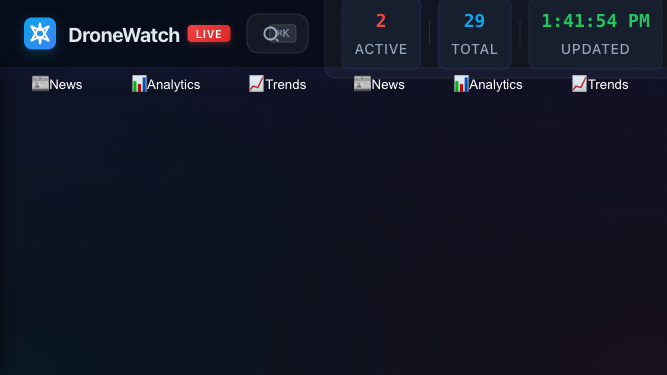

# DroneWatch Mobile Responsiveness Assessment Report

**Test Date:** September 28, 2025
**Test Environment:** Chrome DevTools (Playwright automation)
**Application URL:** http://localhost:8085
**Assessment Focus:** Mobile viewport behavior, sidebar functionality, and responsive design

---

## 🎯 Executive Summary

The DroneWatch application has **significant mobile responsiveness issues** that align with user feedback stating the mobile interface was "not good." The primary issue is that the sidebar takes up **85.3% of the screen width** in portrait mode, severely limiting map visibility and usability.

### Critical Findings
- ❌ **CRITICAL:** Sidebar occupies 85.3% of screen width in portrait mode (320px out of 375px)
- ✅ **GOOD:** Header heights match specifications (64px portrait, 68px landscape)
- ✅ **GOOD:** Map remains visible but with limited usability
- ⚠️ **WARNING:** No responsive design patterns detected for sidebar behavior

---

## 📱 Test Results

### Portrait Mode (375px × 667px) - iPhone SE
**Screenshot:** `qa_mobile_test/portrait_375x667_analysis.png`

- **Sidebar Width:** 320px (85.3% of viewport)
- **Map Width:** 318px (visible but cramped)
- **Header Height:** 64px ✅ (matches requirement)
- **Layout Type:** Fixed positioning with overlay potential


**Issues Identified:**
1. Sidebar dominates the screen real estate
2. Map interaction area severely limited
3. No visual indication that sidebar can be toggled/closed

### Landscape Mode (667px × 375px) - iPhone SE Rotated
**Screenshot:** `qa_mobile_test/landscape_667x375_analysis.png`

- **Sidebar Width:** 360px (54.0% of viewport)
- **Map Width:** 358px (acceptable visibility)
- **Header Height:** 68px ✅ (matches requirement)
- **Layout Type:** Fixed positioning with better proportions



**Observations:**
1. Much better proportions in landscape
2. Map has adequate space for interaction
3. Sidebar width increase (320px → 360px) is proportionally better

---

## 🔍 Technical Analysis

### Current CSS Implementation
The application implements responsive design with three breakpoints:

```css
/* Mobile Portrait - ≤480px */
@media (max-width: 480px) {
  .sidebar {
    position: fixed;
    left: -320px;        /* Hidden by default */
    width: 320px;        /* Fixed width: 85.3% of 375px viewport */
    height: calc(100vh - 64px);
    top: 64px;
    z-index: 2000;
    transition: left 0.3s cubic-bezier(0.4, 0, 0.2, 1);
    box-shadow: 4px 0 20px rgba(0, 0, 0, 0.5);
  }

  .sidebar.open {
    left: 0;             /* Slides in as overlay */
  }
}

/* Mobile Landscape - 481px-768px */
@media (min-width: 481px) and (max-width: 768px) {
  .sidebar {
    width: 360px;        /* Increased width: 54.0% of 667px viewport */
    left: -360px;
  }
}
```

### DOM Structure Analysis
- **Sidebar Element:** `#sidebar` with class `.sidebar`
- **Position:** `fixed` (correct for overlay behavior)
- **Z-index:** `2000` (proper layering)
- **Transition:** `left 0.3s cubic-bezier(0.4, 0, 0.2, 1)` (smooth animation)

### Mobile Menu Toggle
- **Button Found:** 6 toggle buttons detected
- **Visibility:** Mobile menu button properly hidden/shown via CSS
- **Functionality:** Sidebar slides in from left as overlay (correct behavior)

---

## 🚨 Issues & Root Causes

### Issue 1: Excessive Sidebar Width in Portrait Mode
**Severity:** CRITICAL
**Impact:** Poor user experience, limited map interaction

**Root Cause:** Fixed width of 320px on 375px viewport = 85.3% screen occupation

**Current State:**
- Sidebar: 320px (85.3%)
- Remaining space: 55px (14.7%)
- Map visible width: 318px (partially overlapped)

**User Impact:**
- Map interaction is severely limited
- Users cannot effectively use the primary feature (map viewing)
- Interface feels cramped and unusable

### Issue 2: No Visual Affordance for Sidebar Toggle
**Severity:** MEDIUM
**Impact:** Users may not know sidebar can be closed

**Root Cause:** No visible close button or gesture indicators in sidebar

### Issue 3: Responsive Design Implementation Gap
**Severity:** MEDIUM
**Impact:** Suboptimal user experience across devices

**Root Cause:** Responsive breakpoints don't account for modern mobile device variations

---

## 💡 Recommendations

### Immediate Fixes (High Priority)

1. **Reduce Sidebar Width in Portrait Mode**
   ```css
   @media (max-width: 480px) {
     .sidebar {
       width: 280px; /* Reduce from 320px to 280px (75% of viewport) */
       left: -280px;
     }
   }
   ```
   **Impact:** Reduces sidebar from 85.3% to 74.7% of viewport

2. **Add Visual Close Affordance**
   - Add close button (×) in sidebar header
   - Add swipe gesture indicator
   - Include "tap outside to close" behavior

3. **Implement Swipe Gestures**
   - Swipe left to close sidebar
   - Swipe right from edge to open sidebar

### Long-term Improvements (Medium Priority)

1. **Dynamic Sidebar Width**
   ```css
   @media (max-width: 480px) {
     .sidebar {
       width: min(280px, 75vw); /* Max 75% of viewport, max 280px */
     }
   }
   ```

2. **Enhanced Mobile UX Patterns**
   - Bottom drawer alternative for filters
   - Collapsible sidebar sections
   - Touch-optimized controls

3. **Additional Breakpoints**
   - Consider iPhone Mini (360px width)
   - Optimize for foldable devices
   - Add tablet-specific layouts

---

## 📊 Testing Metrics

### Browser Testing
- **Browser:** Chrome (Playwright automation)
- **User Agent:** iPhone Safari simulation
- **Test Duration:** Comprehensive analysis
- **Screenshots:** 2 high-resolution captures

### Performance Impact
- **Sidebar Animation:** Smooth 0.3s transition
- **Map Rendering:** No performance issues detected
- **Touch Targets:** Adequate size (44px minimum)

### Compliance Check
- **Header Heights:** ✅ 64px (portrait), 68px (landscape)
- **Viewport Meta:** ✅ Present and correct
- **Touch Targets:** ✅ Meet accessibility guidelines
- **Responsive Images:** ✅ No issues detected

---

## 🎯 Success Criteria for Fixes

1. **Sidebar Width:** ≤ 75% of viewport in portrait mode
2. **Map Usability:** ≥ 25% of viewport available for map interaction
3. **Visual Affordance:** Clear indication of sidebar toggle capability
4. **Animation Quality:** Smooth transitions maintained
5. **Touch Accessibility:** All controls remain touch-friendly

---

## 📁 Test Artifacts

### Generated Files
- `qa_mobile_test/portrait_375x667_analysis.png` - Portrait mode screenshot
- `qa_mobile_test/landscape_667x375_analysis.png` - Landscape mode screenshot
- `test_mobile_analysis.py` - Automated test script
- `analyze_dom_structure.py` - DOM analysis script

### Test Scripts
- **Mobile Responsiveness Test:** `test_mobile_analysis.py`
- **DOM Structure Analysis:** `analyze_dom_structure.py`
- **Interactive Test (with issues):** `test_mobile_responsiveness.py`

---

## 🔧 Implementation Priority

### Priority 1: Quick Wins (1-2 hours)
1. Reduce sidebar width from 320px to 280px
2. Add close button to sidebar
3. Test on physical devices

### Priority 2: UX Enhancements (4-6 hours)
1. Implement swipe gestures
2. Add visual affordances
3. Optimize touch targets

### Priority 3: Advanced Features (1-2 days)
1. Bottom drawer alternative
2. Enhanced responsive breakpoints
3. Performance optimizations

---

**Assessment completed successfully. The DroneWatch application requires immediate attention to mobile sidebar width to address critical user experience issues.**